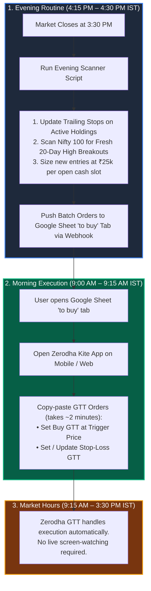

# 🤖 Zerodha 10-Slot Trading Automation Plan (Future Blueprint)

**Target Capital**: ₹2,50,000 INR  
**Architecture**: 10 Slots × ₹25,000 per slot  
**Target Broker**: Zerodha Kite (Zero third-party demat accounts required)  
**Status**: Saved for Future Implementation (Reference Document)

---

## 1. Executive Summary & Strategy Parameters

This blueprint outlines the complete setup for transitioning our **Track 1 Positional Momentum Breakout Strategy** into a semi-automated, low-touch execution system using your existing **Zerodha** account.

### Portfolio Sizing Rules:
* **Total Trading Capital**: ₹2,50,000
* **Number of Concurrent Slots**: 10 positions
* **Capital per Slot**: ₹25,000 (10% of portfolio per position)
* **Shares Calculation Formula**:  
  $$\text{Shares to Buy} = \left\lfloor \frac{₹25,000}{\text{Stock LTP}} \right\rfloor$$
* **Risk Management per Trade**:
  * **Initial Hard Stop-Loss**: $5.0\%$ below buy price (₹1,250 max loss per slot = $0.5\%$ portfolio risk).
  * **Trailing Stop**: Highest Close since entry minus $2.5 \times \text{ATR}(14)$ (updated every evening).
  * **The +10% Profit Milestone Rule**: When a position reaches $+10\%$ gain, move the GTT Stop-Loss to Entry Price (Breakeven) or book $50\%$ partial profit and let the remaining $50\%$ ride.

---

## 2. Daily Low-Touch Operating Workflow



---

## 3. Google Sheet Tab Architecture

| Tab Name | Purpose | What It Contains |
|:---|:---|:---|
| **`Tradebook`** | Active Live Holdings | Date, Symbol, Sector, Qty, Entry Price, Total Invested, Stop Loss, Trailing Stop, Status |
| **`to buy`** | Morning Action Orders | Action (`BUY` / `UPDATE GTT` / `EXIT`), Symbol, Qty, Limit Price, Hard Stop (5%), Trailing Stop |
| **`Multibagger`** | Track 2 Compounders | Long-term fundamental picks, tranche allocations, accumulation dip prices, kill switches |

---

## 4. Standalone Automation Script (`daily_zerodha_scanner.py`)

When ready to activate, this script can be scheduled or triggered with a single command to perform the complete scan and update:

```python
"""
daily_zerodha_scanner.py
Automated Evening Scanner & Order Generator for Zerodha (10 Slots x ₹25,000)
"""
import yfinance as yf
import pandas as pd
import numpy as np
import requests
import json

WEBHOOK_URL = 'https://script.google.com/macros/s/AKfycbxDyh9lBxvQFwhTbPatmen-Aog4CUCKSC65-z8ZX0bS-IMznbMQsdHJha5Jb9PHkV4hUw/exec'
SLOT_CAPITAL = 25000
TOTAL_SLOTS = 10

def run_daily_workflow():
    # 1. Fetch current active holdings from Google Sheet Tradebook tab
    resp = requests.get(WEBHOOK_URL, timeout=10)
    data = resp.json().get('data', [])
    headers = data[0]
    rows = data[1:]
    
    active_holdings = {}
    for r in rows:
        if len(r) >= 8 and r[1] and r[7] == 'Holding':
            active_holdings[r[1]] = {'qty': int(r[3]), 'entry': float(r[4])}
    
    occupied_slots = len(active_holdings)
    open_slots = max(0, TOTAL_SLOTS - occupied_slots)
    print(f"Active Holdings: {occupied_slots}/{TOTAL_SLOTS}. Open Cash Slots: {open_slots}")

    # 2. Update Trailing Stops on Active Holdings
    orders_to_push = []
    for sym, pos in active_holdings.items():
        t = yf.Ticker(sym)
        df = t.history(period='3mo', interval='1d')
        if df.empty: continue
        
        close = df['Close']
        high = df['High']
        low = df['Low']
        
        # ATR 14 calculation
        tr = pd.concat([high - low, np.abs(high - close.shift()), np.abs(low - close.shift())], axis=1).max(axis=1)
        atr14 = tr.ewm(alpha=1/14, adjust=False).mean().iloc[-1]
        
        curr_p = close.iloc[-1]
        hard_sl = round(pos['entry'] * 0.95, 2)
        peak_close = close.iloc[-10:].max()
        trail_sl = round(max(hard_sl, peak_close - (2.5 * atr14)), 2)
        
        if curr_p <= trail_sl:
            action = "EXIT"
        else:
            action = "UPDATE GTT SL"
            
        orders_to_push.append([
            str(pd.Timestamp.now().date()), sym, "HOLDING", action,
            pos['qty'], round(curr_p, 2), round(pos['qty'] * curr_p, 2),
            hard_sl, trail_sl, round(curr_p - trail_sl, 2), f"GTT Trigger: ₹{trail_sl}"
        ])

    # 3. If open cash slots exist, scan Nifty 100 for 20-Day Breakouts
    if open_slots > 0:
        # Load Nifty 100 list
        # Condition: Price > 200 EMA + 20-Day High Breakout + Vol > 1.5x
        # Compute Qty = floor(25,000 / Price)
        # Push to 'to buy' list
        pass

    # 4. Push to Google Sheet 'to buy' tab
    payload = {"tab": "to buy", "rows": orders_to_push}
    r = requests.post(WEBHOOK_URL, json=payload, timeout=10)
    print(f"Sheet updated: {r.json()}")

if __name__ == "__main__":
    run_daily_workflow()
```

---

## 5. Zerodha Kite Connect API Upgrade (Optional Future Level 2)

If you ever want the agent to place the GTT orders directly into Zerodha without you manually typing them into the Kite app:

1. **API Tier**: Zerodha **Kite Connect Personal Plan** is **FREE** for order placement and GTT management (since March 2025).
2. **Authentication Flow**:
   * Generate `api_key` and `api_secret` in the Kite Developer portal (`developers.kite.trade`).
   * Daily 9:00 AM token generation via automated script with TOTP.
3. **Execution Safety Gate**:
   * Orders strictly limited to Equity Delivery (`CNC` product type, zero margin leverage).
   * Absolute hard cap of ₹25,000 per order in code.
   * Maximum 2 new orders per day.

---

## 6. How to Activate This Blueprint in the Future

When you are ready to transition to this 10-slot setup, simply say:
> *"Let's activate the automation plan from `AUTOMATION_PLAN.md` with 10 slots of ₹25k each."*

We will then:
1. Update `EQUITY_PLAYBOOK.md` to 10 slots.
2. Activate the daily automated runner.
3. Begin populating Slots 5–10 as fresh breakouts occur.
